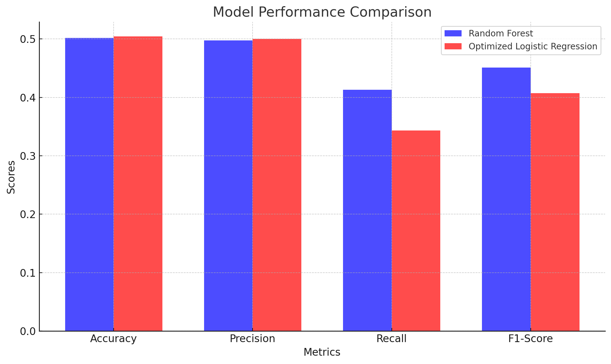

Customer Churn Prediction Report

Introduction:

The objective of this project was to develop a machine learning model to predict customer churn based on historical customer data. The dataset provided contained 100,000 entries with various features related to customers.

Data Preprocessing:

Loading & Initial Exploration: The dataset was loaded, and basic exploratory data analysis was conducted to understand its structure, features, and target variable.

Handling Missing Data: Rows with missing values in the Gender and Location columns were removed to ensure data consistency.

 Encoding Categorical Variables: Categorical variables like Gender and Location were label encoded to convert them into numerical format suitable for machine learning algorithms.

Feature Engineering:

Usage per Dollar: A new feature was derived by dividing Total_Usage_GB by Monthly_Bill. This feature provides insight into how much data usage a customer gets for every dollar they spend, potentially indicating their perceived value.

 Age Grouping: Based on the age distribution, the customers were grouped into five age categories: 18-30, 31-40, 41-50, 51-60, and 61-70. This helped in capturing potential patterns among different age groups.
 
Feature Scaling: Features like Age, Subscription_Length_Months, Monthly_Bill, Total_Usage_GB, and Usage_per_Dollar were scaled using Min-Max scaling to ensure they are on a similar scale.

Model Building:

Random Forest Classifier: This model was chosen due to its ability to handle both linear and non-linear data, manage high dimensional data, and provide feature importance insights. The model was trained using default hyperparameters. It provided an accuracy of around 50%.

Logistic Regression: A baseline Logistic Regression model was trained and its performance evaluated. It provided an accuracy of Less than 50%.

Optimized Logistic Regression: Given hyperparameters obtained externally, an optimized Logistic Regression model was trained. This model offered a modest improvement over the baseline model with an accuracy of More than 50%.

Model Optimization:

Random Forest Hyperparameter Tuning: A randomized search was performed to optimize the Random Forest model's hyperparameters. The provided optimal parameters were: n_estimators: 150, min_samples_split: 2, min_samples_leaf: 5, max_features: 'log2', and max_depth: 10. RandomizedSearchCV was used to optimize hyperparameters for the Random Forest model.

Logistic Regression Hyperparameter Tuning: The hyperparameters for the logistic regression were also optimized with the help of RandomizedSearchCV, and the provided optimal parameters were used: ‘solver’: 'newton-cg', ‘penalty’: 'l2', and ‘C’: 0.0001.

Model Deployment:

A simulated deployment was demonstrated. The trained Optimized  Logistic Regression model was serialized and saved to a file, it being the model with the most accuracy. The model was then loaded from this file to make predictions on new data, showcasing a potential real-world deployment scenario.

Model performance metrics and visualizations:

Accuracy: Both models have similar accuracy, with the Optimized Logistic Regression model performing slightly better.

Precision: The Optimized Logistic Regression model has a slightly higher precision than the Random Forest model.

Recall: The recall for both models is close, with the Random Forest model having a slight edge.

F1-Score: Both models have similar F1-scores, indicating a balanced performance between precision and recall.

This visualization provides a clear comparison of the two models across various metrics, helping in making informed decisions about model selection.

